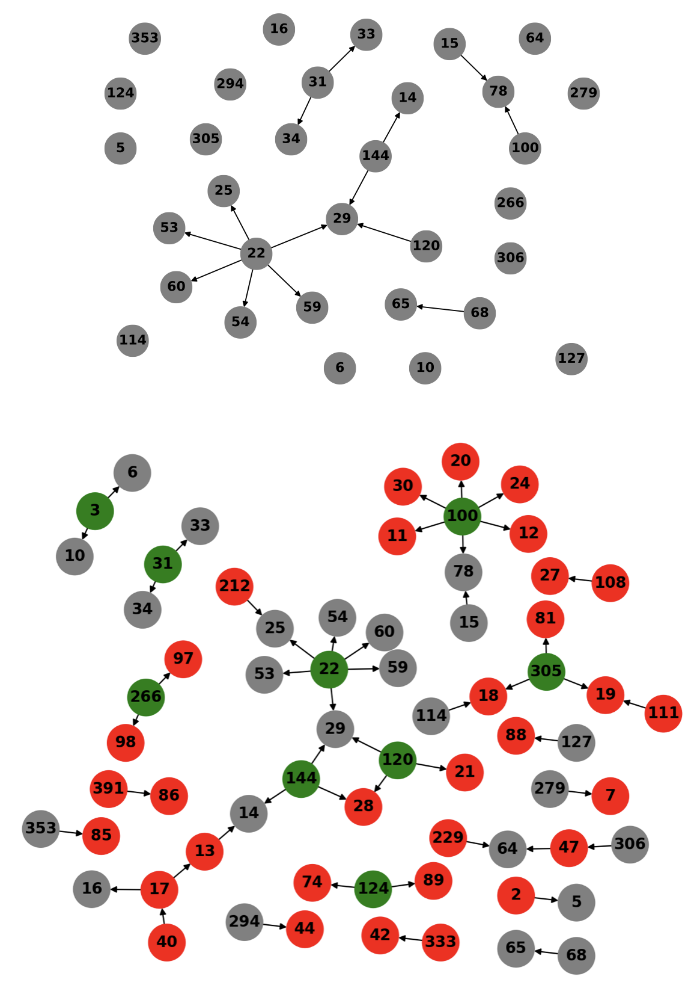

## Identifying Likely-Infected Nodes and Reconstructing the Infection Trace for COVID-19

  

Meet the team! (Vidushi, Abhinav, and Kasturi from L-R)

### Overview

As a part of CSE 8803, we undertook the task of indentifying missed infections in the reported cases of COVID spread across Singapore and Korea. The choice of the countries of study was decided on the basis of data available. Singapore and Korea had extensively monitored the spread of COVID and systematically recorded and released relevant data. The Singapore dataset can be found here: [Singapore Dataset](https://www.againstcovid19.com/singapore/dashboard) and the Korea Dataset can be found here: [Korea Dataset](https://www.kaggle.com/kimjihoo/coronavirusdataset). 

We utilised two state of the art algorithms towards this end: [NETFILL](https://epubs.siam.org/doi/pdf/10.1137/1.9781611974010.47) and [CuLT](https://dl.acm.org/doi/pdf/10.1145/2939672.2939865). We were able to successfully reconstruct the spread of COVID in Korea using CuLT very accurately. We were also able to find cuplrit and missed infections in small cliques of infections. To find the details of the experiments and inferences made on the calculated outputs, please refer to: 
- [Report](report.pdf)
- [Presentation](https://gtvault-my.sharepoint.com/:p:/g/personal/kshriniwas3_gatech_edu/EcY7P0JhUIpNu7fjbY6tldgBAynYpBCNYurPoQ020Hfc5Q?e=i1W7LL) of the talk given in class. 
- [Code](https://github.com/BonJovi1/CSE8803)

### Abstract
It is a challenging problem in epidemiology to map out the exact trace of the spread of infection during pandemics such as Covid-19 due to the extremely high rates at which these viruses spread and infect people. In this work, we aim to reconstruct the propagation of infection for Covid-19 in South Korea. We attempt to recover the exact trace of infection, which includes identifying other likely-infected nodes that are unreported, as well as the seeds or culprits of the network. We employ CuLT which maps this reconstruction task into the classic directed Steiner-tree problem. We construct the temporal network consisting of patient interactions and an initial list of reported infections from the DS4C dataset. We subsequently use CuLT to recover the flow of infection in South Korea during the Covid-19 pandemic, whilst identifying the missing infections. This work showcases the robustness and scalability of approaches like CuLT on real-world epidemiological datasets to successfully recover the flow of spread of infection.

  

Top: the reported infection nodes in the network. Bottom: the recovered trace of infec- tion after employing CuLT. The nodes in red are the likely- infected nodes that were not reported in the figure on top. The nodes in green are the seed nodes identified while re- constructing the propagation of infection.

### Support or Contact

If you have any questions regarding our work feel free to reach out to us or open issues in the repository!
